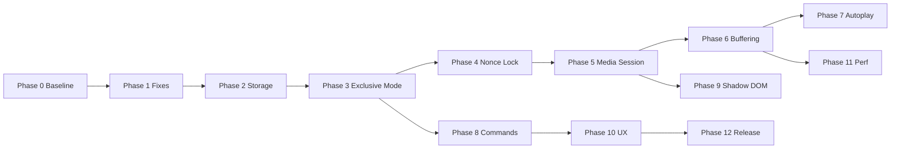

# TogglePlay v2 — Implementation Roadmap

**Target release:** `2.0.0`  
**Sources:** [METHODS-AUDIT.md](./METHODS-AUDIT.md) · [Architectural Overhaul.md](../Architectural%20Overhaul.md)  
**Principles:** Media Session first · DOM fallback only · stateless service worker · Exclusive Mode default · nonce echo suppression · zero site-keyboard conflicts

Use this file as the single execution checklist. Mark steps `[x]` when done. Do not skip **Acceptance criteria** at the end of each phase.

---

## How to use this roadmap

| Symbol | Meaning |
|--------|---------|
| `[ ]` | Not started |
| `[x]` | Done |
| **Phase N** | Shippable milestone — test before moving on |
| **Depends on** | Prior phase(s) required |

**Efficiency rule:** Build shared modules once in `src/content/shared/` and `src/shared/`; platform folders only wire adapters.

---

## Target repository structure (v2)

```
TogglePlay/
├── manifest.json
├── assets/
│   └── icon.png
├── docs/
│   ├── METHODS-AUDIT.md
│   └── IMPLEMENTATION-ROADMAP.md          ← this file
├── scripts/
│   └── package.sh
├── src/
│   ├── shared/
│   │   ├── config.js                      # constants, storage keys, debounce defaults
│   │   ├── platforms.js                   # URL detection (single source of truth)
│   │   ├── messages.js                    # NEW — message types + payload shapes
│   │   └── storage-serializers.js         # NEW — Map/Set ↔ JSON for chrome.storage
│   ├── background/
│   │   ├── service-worker.js              # entry: listeners + hydrate on wake
│   │   ├── state.js                       # in-memory cache (hydrated from storage)
│   │   ├── storage.js                     # NEW — read/write local + session
│   │   ├── hydration.js                   # NEW — startup reconcile + prune stale tabs
│   │   ├── pairing.js
│   │   ├── playback-sync.js               # modes + nonce-aware sync engine
│   │   ├── sync-modes.js                  # NEW — Exclusive / Mirror state machine
│   │   ├── command-lock.js                # NEW — nonce registry + validation
│   │   ├── tabs.js
│   │   ├── tab-lifecycle.js               # NEW — onRemoved, onUpdated cleanup
│   │   ├── commands.js                    # NEW — chrome.commands handlers
│   │   ├── message-handler.js
│   │   └── log.js
│   ├── content/
│   │   ├── shared/
│   │   │   ├── context.js
│   │   │   ├── messaging.js
│   │   │   ├── media-session-adapter.js   # NEW — detect + control via Media Session
│   │   │   ├── video-adapter.js           # NEW — HTMLMediaElement path
│   │   │   ├── buffering-detector.js      # NEW — waiting/stalled + readyState
│   │   │   ├── playback-notifier.js       # NEW — debounced PLAYBACK_STATE_CHANGED
│   │   │   ├── command-echo-guard.js      # NEW — suppress programmatic echo
│   │   │   ├── autoplay-unlock.js         # NEW — gesture unlock for programmatic play
│   │   │   ├── shadow-query.js            # NEW — deep shadow DOM query (fallback only)
│   │   │   └── dom-button-adapter.js      # NEW — aria-label / click fallback (Spotify)
│   │   ├── youtube/
│   │   │   └── index.js                   # thin: compose adapters + SPA hooks
│   │   ├── ytmusic/
│   │   │   └── index.js
│   │   └── spotify/
│   │       └── index.js
│   ├── popup/
│   │   ├── popup.html
│   │   ├── popup.css
│   │   └── popup.js
│   ├── privacy/
│   │   ├── privacy.html
│   │   ├── privacy.css
│   │   └── privacy.js
│   └── options/                           # NEW
│       ├── options.html
│       ├── options.css
│       └── options.js
└── tests/                                 # NEW (optional but recommended)
    ├── manual-test-matrix.md
    └── fixtures/
```

---

## Phase 0 — Baseline (already shipped in 1.2.1)

> **Status:** Mostly complete. Verify each box still true after refactors.

- [x] **Step 0.1:** `src/` layout — background, content per platform, popup, shared config/platforms
- [x] **Step 0.2:** MV3 service worker at `src/background/service-worker.js`
- [x] **Step 0.3:** Content scripts inject shared `context.js` + `messaging.js`
- [x] **Step 0.4:** Pairing + bidirectional sync in `playback-sync.js`
- [x] **Step 0.5:** Popup lists tabs, creates single pair, enable toggle
- [ ] **Step 0.6:** Remove outdated docs (README spacebar claim, dead `prompt.md` reference) — do in Phase 12

**Acceptance:** Extension loads unpacked; YouTube ↔ Spotify pair syncs (with known mirror-mode quirks).

---

## Phase 1 — Foundation fixes (quick wins)

**Goal:** Fix correctness bugs without new permissions.  
**Depends on:** Phase 0  
**Estimated effort:** 1–2 days

### 1.1 Single source of truth for YouTube URLs

- [x] **Step 1.1:** Add `isYouTubeMediaTab(url)` to `src/shared/platforms.js` (watch, shorts, embed, youtu.be)
- [x] **Step 1.2:** Replace inline filter in `src/background/tabs.js` `getYouTubeTabs()` — use `TogglePlayPlatforms.isYouTubeUrl()` (same rules as popup)
- [x] **Step 1.3:** Add unit-style comment block in `platforms.js` listing supported path patterns for future testers

### 1.2 Unified message protocol

- [x] **Step 1.4:** Create `src/shared/messages.js` with constants:
  - `GET_TAB_ID`, `PLAYBACK_STATE_CHANGED`, `CONTROL_PLAYBACK`, `GET_PLAYBACK_STATE`, `PAUSE_BOTH`, `PING`
  - Payload: `{ type, tabId?, isPlaying?, action?, commandId?, source? }`
- [x] **Step 1.5:** Rename YT Music `GET_STATE` → `GET_PLAYBACK_STATE` in `src/content/ytmusic/index.js`
- [x] **Step 1.6:** Update `message-handler.js` + all content scripts to use shared constants

### 1.3 YT Music parity

- [x] **Step 1.7:** Add `src/content/shared/keyboard.js` to YT Music manifest entry (match YouTube/Spotify)
- [x] **Step 1.8:** Wire `setupPauseBothShortcut` in `src/content/ytmusic/index.js` with `onLocalPause` → video pause or button click

### 1.4 Spotify hygiene

- [x] **Step 1.9:** Fix `src/content/spotify/index.js` header comment (remove “spacebar” claim)
- [x] **Step 1.10:** Call `isWebPlayerActive()` before `controlPlayback`; return `{ success: false, reason: 'DEVICE_NOT_WEB' }` when inactive
- [x] **Step 1.11:** Surface device warning in popup when Spotify tab reports non-web player (banner on tab row)

**Acceptance:**
- Shorts tab appears in GET_TABS and can be paired
- All three platforms respond to `GET_PLAYBACK_STATE`
- YT Music **B** pauses both (until Phase 7 replaces with `chrome.commands`)

---

## Phase 2 — Persistence & stateless service worker

**Goal:** Survive SW sleep and browser restart (preferences + session pairs).  
**Depends on:** Phase 1  
**Estimated effort:** 2–3 days  
**References:** Architectural Overhaul § “Architecting State Persistence”

### 2.1 Manifest & permissions

- [x] **Step 2.1:** Add `"storage"` to `manifest.json` `permissions`
- [x] **Step 2.2:** Bump version to `2.0.0-beta.1` when storage lands

### 2.2 Storage layer

- [x] **Step 2.3:** Create `src/shared/storage-serializers.js`
  - `setToArray(set)` / `arrayToSet(arr)`
  - `mapToObject(map)` / `objectToMap(obj)` for pairs if needed
- [x] **Step 2.4:** Create `src/background/storage.js`
  - **local:** `enabled`, `syncMode` (`exclusive` | `mirror`), `debounceMs` overrides, `commandShortcuts` metadata
  - **session:** `pairs` (tabId pairs + titles + urls + sourceTypes), `lastCommandIds`
- [x] **Step 2.5:** Extend `TogglePlayConfig.STORAGE_KEYS` in `config.js` with `SYNC_MODE`, `PAIRS_SESSION`, etc.

### 2.3 Hydration

- [x] **Step 2.6:** Create `src/background/hydration.js`
  - `hydrateState()` on `runtime.onStartup`, `runtime.onInstalled`, first `onMessage`
  - Load local + session → populate `togglePlayBackgroundState`
  - `pruneInvalidPairs()`: `chrome.tabs.get` each id; remove missing
- [x] **Step 2.7:** Call `hydrateState()` at top of `service-worker.js` before handling messages
- [x] **Step 2.8:** On `ADD_PAIR` / `REMOVE_PAIR` / `CLEAR_ALL_PAIRS` / `SET_ENABLED` — persist after memory update

### 2.4 Tab lifecycle

- [x] **Step 2.9:** Create `src/background/tab-lifecycle.js`
  - `chrome.tabs.onRemoved` → remove pair entries involving tabId, persist session
  - `chrome.tabs.onUpdated` → if URL leaves media origin, remove pair or mark degraded
- [x] **Step 2.10:** Register listeners in `service-worker.js`

**Acceptance:**
- Pair survives: close popup → wait 60s (SW sleep) → play/pause still syncs
- `enabled` survives browser restart
- Closed tab disappears from pair without manual clear

---

## Phase 3 — Sync modes (Exclusive default)

**Goal:** Stop “pause A → auto-play B” unless user opts into Mirror Mode.  
**Depends on:** Phase 2  
**Estimated effort:** 1–2 days  
**References:** Architectural Overhaul § “Exclusive Playback Modality”

### 3.1 State machine

- [x] **Step 3.1:** Create `src/background/sync-modes.js`
  - `EXCLUSIVE`: play on A → pause B; pause on A → **no op** on B
  - `MIRROR`: current behavior (pause A → play B)
- [x] **Step 3.2:** Default `syncMode` in storage: `exclusive`
- [x] **Step 3.3:** Refactor `handlePlaybackStateChange` in `playback-sync.js` to call `SyncModes.resolveAction(mode, isPlaying)`

### 3.2 UI

- [x] **Step 3.4:** Popup: add sync mode selector (Exclusive / Mirror) with short descriptions
- [x] **Step 3.5:** `SET_SYNC_MODE` message type; persist to `storage.local`
- [ ] **Step 3.6:** Options page stub (can be minimal) — duplicate sync mode control (full options in Phase 11)

**Acceptance:**
- Exclusive: pause YouTube → Spotify stays paused
- Mirror: pause YouTube → Spotify plays (legacy behavior)
- Setting persists across restart

---

## Phase 4 — Nonce-based echo suppression (replace timeout loop guard)

**Goal:** Instant, race-proof sync without 1000ms `controlledTabs` hacks.  
**Depends on:** Phase 1 (messages), Phase 3 recommended  
**Estimated effort:** 2–3 days  
**References:** Architectural Overhaul § “Distributed Locking”

### 4.1 Protocol

- [ ] **Step 4.1:** Add `commandId` (uuid or `performance.now() + random`) to `CONTROL_PLAYBACK` in `messages.js`
- [ ] **Step 4.2:** `PLAYBACK_STATE_CHANGED` may include `commandId` when echo of programmatic control

### 4.2 Background

- [ ] **Step 4.3:** Create `src/background/command-lock.js`
  - `issueCommand(pairedTabId, action)` → generates id, stores in session `pendingCommands` Map with TTL 2s
  - `shouldIgnoreStateChange(tabId, commandId)` → true if matches pending
- [ ] **Step 4.4:** Replace `controlledTabs` Set + timeout in `playback-sync.js` with command-lock
- [ ] **Step 4.5:** Keep short fallback timeout (200ms) only for missing commandId (legacy content scripts during rollout)

### 4.3 Content

- [ ] **Step 4.6:** Create `src/content/shared/command-echo-guard.js`
  - `runControlledAction(commandId, fn)` — sets flag, runs play/pause/click, clears after microtask
  - While flag set, do not emit `PLAYBACK_STATE_CHANGED`
- [ ] **Step 4.7:** Integrate in all three platform `index.js` message handlers for `CONTROL_PLAYBACK`

**Acceptance:**
- Rapid double-click play/pause on both tabs — no stutter loop
- No reliance on 1000ms ignore window for normal use

---

## Phase 5 — Media Session adapter (primary detection & control)

**Goal:** Stable API layer; DOM only when Media Session unavailable.  
**Depends on:** Phase 4  
**Estimated effort:** 3–5 days  
**References:** Architectural Overhaul § “Media Session API”

### 5.1 Shared adapter

- [ ] **Step 5.1:** Create `src/content/shared/media-session-adapter.js`
  - `canUseMediaSession()` — `'mediaSession' in navigator`
  - `getPlaybackState()` — read `navigator.mediaSession.playbackState` (`playing` | `paused` | `none`)
  - `onPlaybackStateChange(cb)` — poll 250ms **or** hook `setActionHandler` overrides if feasible
  - `control(action)` — prefer triggering registered handlers; document limitations
- [ ] **Step 5.2:** Research spike doc (inline comment): which sites expose handlers vs read-only — **test on YT, YT Music, Spotify**

### 5.2 Platform integration

- [ ] **Step 5.3:** YouTube `index.js`: detection stack = Media Session → video adapter → DOM
- [ ] **Step 5.4:** YT Music: same stack + shadow DOM button fallback via `dom-button-adapter.js`
- [ ] **Step 5.5:** Spotify: **primary** Media Session; **fallback** `dom-button-adapter.js` (keep SVG heuristic as last resort)

### 5.3 Manifest injection order

- [ ] **Step 5.6:** Add `media-session-adapter.js` to all three `content_scripts` js arrays **before** platform `index.js`

**Acceptance:**
- Spotify sync works after UI redesign that changes `data-testid` (if Media Session still exposed)
- DevTools: `navigator.mediaSession.playbackState` correlates with extension state on all three

---

## Phase 6 — Video adapter + smart buffering

**Goal:** No false “pause” during network stall; reliable HTML5 path for YouTube/YT Music.  
**Depends on:** Phase 5  
**Estimated effort:** 2–4 days  
**References:** Architectural Overhaul § “Buffering Detection”

### 6.1 Video adapter

- [ ] **Step 6.1:** Create `src/content/shared/video-adapter.js`
  - `findVideo()` — query + readiness (`readyState`, `duration`)
  - `getPlaybackState(video)` — enhanced: consult `BufferingDetector`
  - `control(video, action)` — play/pause with button fallback callback
- [ ] **Step 6.2:** Create `src/content/shared/buffering-detector.js`
  - Listen: `waiting`, `stalled`, `playing`, `pause`, `ended`
  - Track `lastWaitingAt`; if pause within 500ms of waiting → **buffering**, do not notify
  - Check `readyState < HAVE_ENOUGH_DATA` (4) on pause
- [ ] **Step 6.3:** Optional high-frequency delta check (50ms) behind config flag `ENABLE_DELTA_BUFFER_DETECT`

### 6.2 Notifier

- [ ] **Step 6.4:** Create `src/content/shared/playback-notifier.js`
  - Central debounce from `TogglePlayConfig.DEBOUNCE_MS`
  - Skip notify when buffering
  - `force` flag for initial state

### 6.3 YouTube SPA

- [ ] **Step 6.5:** Add `webNavigation` permission + `chrome.webNavigation.onHistoryStateUpdated` for `youtube.com` → re-bind video
- [ ] **Step 6.6:** Alternatively: listen `yt-navigate-finish` on document (fallback only)
- [ ] **Step 6.7:** Reduce `setInterval` poll from 2000ms → 500ms only when video not found

**Acceptance:**
- Throttle network (DevTools) → partner tab does **not** start during buffer
- Navigate watch → watch on YouTube without 2s dead zone

---

## Phase 7 — Autoplay unlock

**Goal:** Programmatic `play()` succeeds on background tab after one user gesture.  
**Depends on:** Phase 6  
**Estimated effort:** 1–2 days  
**References:** Architectural Overhaul § “Autoplay Policy”

- [ ] **Step 7.1:** Create `src/content/shared/autoplay-unlock.js`
  - On first `click`/`keydown` anywhere (capture), call `video.play().then(() => video.pause())` or silent unlock pattern
  - Set `state.autoplayUnlocked = true` per tab session
- [ ] **Step 7.2:** `video-adapter.control(PLAY)` — if unlocked use `video.play()`; else try Media Session → button click
- [ ] **Step 7.3:** Mirror Mode play-B path: background sends PLAY only after popup/command gesture (Phase 8)

**Acceptance:**
- Mirror mode: pause tab A → tab B plays even when B was in background (after user interacted once with B)

---

## Phase 8 — `chrome.commands` (remove DOM keyboard hacks)

**Goal:** Zero conflict with site shortcuts; user-remappable in `chrome://extensions/shortcuts`.  
**Depends on:** Phase 3, Phase 4  
**Estimated effort:** 1 day

- [ ] **Step 8.1:** Add to `manifest.json`:
  ```json
  "commands": {
    "pause-both": {
      "suggested_key": { "default": "Ctrl+Shift+Period", "mac": "Command+Shift+Period" },
      "description": "Pause all paired media tabs"
    },
    "toggle-sync-enabled": {
      "suggested_key": { "default": "Ctrl+Shift+Y", "mac": "Command+Shift+Y" },
      "description": "Enable or disable TogglePlay sync"
    }
  }
  ```
- [ ] **Step 8.2:** Create `src/background/commands.js` — `chrome.commands.onCommand` → `handlePauseBoth` / toggle enabled
- [ ] **Step 8.3:** Remove `src/content/shared/keyboard.js` from manifest entries
- [ ] **Step 8.4:** Delete or deprecate `keyboard.js`; update README (no more **B** key)
- [ ] **Step 8.5:** Popup: show configured shortcuts + link to `chrome://extensions/shortcuts`

**Acceptance:**
- Typing “b” in YouTube comment box never triggers extension
- Pause-both works from any tab/window (global command)

---

## Phase 9 — Shadow DOM fallback (YT Music only)

**Goal:** Last-resort DOM access when Media Session + video fail.  
**Depends on:** Phase 5  
**Estimated effort:** 1–2 days  
**References:** Architectural Overhaul § “Shadow DOM Piercing”

- [ ] **Step 9.1:** Create `src/content/shared/shadow-query.js` — recursive `shadowRoot` walker + `querySelectorDeep` (no closed-root hacking in v2.0)
- [ ] **Step 9.2:** Create `src/content/shared/dom-button-adapter.js` — centralized selectors for YT Music + Spotify
- [ ] **Step 9.3:** YT Music: use shadow query for `#play-pause-button` before giving up
- [ ] **Step 9.4:** Document: **do not** override `attachShadow` in v2.0 (store review risk) — revisit only if unavoidable

**Acceptance:**
- YT Music play/pause works when button lives inside open shadow root

---

## Phase 10 — Popup & options UX (polish)

**Goal:** Professional UI reflecting new capabilities.  
**Depends on:** Phases 2, 3, 8  
**Estimated effort:** 2–3 days

- [ ] **Step 10.1:** Create `src/options/options.html|css|js` + `manifest.json` `options_ui`
- [ ] **Step 10.2:** Options: sync mode, debounce sliders (per platform), enable delta buffer detect, debug logging
- [ ] **Step 10.3:** Popup: connection status dot — green when SW responds to PING
- [ ] **Step 10.4:** Popup: show sync mode + Spotify device warning inline
- [ ] **Step 10.5:** Popup: “Tab closed” / “URL changed” degraded pair state
- [ ] **Step 10.6:** Reduce popup poll from 10s → 5s only when popup open (use `chrome.runtime.connect` port optional)

**Acceptance:**
- All settings persist; options page accessible from extension details

---

## Phase 11 — Performance & efficiency pass

**Goal:** Minimize CPU/battery; avoid redundant work.  
**Depends on:** Phases 5–6  
**Estimated effort:** 1–2 days

- [ ] **Step 11.1:** Spotify: remove 500ms poll when Media Session events reliable; poll at 2s as backup only
- [ ] **Step 11.2:** YouTube: stop interval when video bound + navigation listener active
- [ ] **Step 11.3:** `MutationObserver` scope: smallest container (now-playing bar), not `document.body` where possible
- [ ] **Step 11.4:** Debounce defaults: tune to 200ms global (configurable) — measure double-fire rate
- [ ] **Step 11.5:** Batch `chrome.storage` writes (debounce 100ms) to avoid SW write storms
- [ ] **Step 11.6:** `sendMessageToTab`: no-op if tab discarded — catch `Receiving end does not exist` without log spam

**Acceptance:**
- Idle paired tabs: negligible CPU in Chrome Task Manager (<1% on one tab)
- No duplicate `PLAYBACK_STATE_CHANGED` for single user click

---

## Phase 12 — Testing, docs, release

**Goal:** Ship `2.0.0` with confidence.  
**Depends on:** All prior phases  
**Estimated effort:** 2–3 days

### 12.1 Manual test matrix

- [ ] **Step 12.1:** Create `tests/manual-test-matrix.md` (copy table below; check each release)

| # | Primary | Secondary | Mode | Action | Expected |
|---|---------|-----------|------|--------|----------|
| 1 | YouTube watch | Spotify | Exclusive | Play YT | Spotify pauses |
| 2 | YouTube watch | Spotify | Exclusive | Pause YT | Spotify stays paused |
| 3 | YouTube watch | Spotify | Mirror | Pause YT | Spotify plays |
| 4 | YT Music | YouTube | Exclusive | Play either | Other pauses |
| 5 | YouTube Shorts | Spotify | Exclusive | Pair from popup | Shorts listed + sync |
| 6 | Spotify (web) | YT | Exclusive | Play Spotify | YT pauses |
| 7 | Spotify (phone device) | YT | Exclusive | Play | Warning shown; no false sync |
| 8 | Any | Any | — | Close one tab | Pair pruned |
| 9 | Any | Any | — | SW sleep 60s | Pair + sync persist |
| 10 | Any | Any | — | `pause-both` command | Both pause |
| 11 | YouTube | Spotify | — | Buffer YT (3G throttle) | Spotify does not start |
| 12 | YT Music | Spotify | — | Rapid double-click pause | No echo loop |

### 12.2 Documentation

- [ ] **Step 12.2:** Rewrite README: Exclusive default, chrome.commands, storage behavior
- [ ] **Step 12.3:** Update `docs/METHODS-AUDIT.md` post-ship (or add “v2 addendum” section)
- [ ] **Step 12.4:** Update `src/privacy/privacy.html` if new permissions (`storage`, `webNavigation`)

### 12.3 Release

- [ ] **Step 12.5:** Run `./scripts/package.sh` → verify zip loads in Chrome + Edge
- [ ] **Step 12.6:** Tag `v2.0.0`; store listing changelog

**Acceptance:** Full matrix passed on Chrome + Edge (Chromium).

---

## Phase 13 — v2.1+ backlog (power features)

> Not required for 2.0.0. Research before building.

### 13.1 Context-aware pause

- [ ] **Step 13.1:** `chrome.tabCapture` + mic activity — pause media when microphone active (optional permission)
- [ ] **Step 13.2:** “Pause all media tabs” global command (Gob Stopper–style)

### 13.2 Audio quality

- [ ] **Step 13.3:** Per-tab volume normalization via `AudioContext` + `DynamicsCompressorNode`
- [ ] **Step 13.4:** Fade-out / fade-in on switch (100–200ms) to prevent clicks

### 13.3 Spotify advanced

- [ ] **Step 13.5:** Evaluate Spotify Web API (OAuth + Premium) for Connect device control
- [ ] **Step 13.6:** Reject or queue actions when active device ≠ web player

### 13.4 Multi-pair & focus mode

- [ ] **Step 13.7:** Multiple pairs with active “focus” pair
- [ ] **Step 13.8:** “Follow focus” mode — only focused tab drives partner

### 13.5 Engineering

- [ ] **Step 13.9:** Playwright extension harness for smoke tests
- [ ] **Step 13.10:** `webextension-polyfill` for Firefox port

---

## Implementation order (critical path)



**Parallelizable:** Phase 9 can run alongside Phase 6–7. Phase 10 UI can start after Phase 3.

---

## Message protocol v2 (target contract)

| Type | Direction | Payload | Notes |
|------|-----------|---------|-------|
| `GET_TAB_ID` | content → BG | — | Returns `{ tabId }` |
| `PLAYBACK_STATE_CHANGED` | content → BG | `isPlaying`, `source`, `commandId?` | Debounced; suppressed during buffer |
| `CONTROL_PLAYBACK` | BG → content | `action`, `commandId` | Echo-guarded |
| `GET_PLAYBACK_STATE` | either | — | Unified name all platforms |
| `PAUSE_BOTH` | content/command → BG | — | Exclusive-safe |
| `SET_ENABLED` | popup → BG | `enabled` | Persists local |
| `SET_SYNC_MODE` | popup/options → BG | `mode: exclusive\|mirror` | Persists local |
| `GET_TABS` | popup → BG | — | Uses shared URL rules |
| `GET_PAIRS` | popup → BG | — | Hydrated session |
| `ADD_PAIR` | popup → BG | `tabId1`, `tabId2` | Persists session |
| `PING` | any | — | Health check |

---

## Efficiency & quality checklist (apply every PR)

- [ ] No duplicate URL logic outside `platforms.js`
- [ ] No raw `setTimeout` loop guards — use `commandId`
- [ ] No new `keydown` listeners in content scripts
- [ ] Platform `index.js` files stay under ~150 lines (adapters do the work)
- [ ] Every `chrome.storage` write serializes Map/Set
- [ ] Every user-visible behavior has a row in manual test matrix

---

## Version milestones

| Version | Phases included | User-visible theme |
|---------|-----------------|-------------------|
| `1.2.1` | 0 | Current — DOM/heuristic, mirror-only, RAM state |
| `2.0.0-beta.1` | 1–2 | Fixes + persistence |
| `2.0.0-beta.2` | 3–4 | Exclusive mode + stable sync |
| `2.0.0-beta.3` | 5–7 | Media Session + buffering + autoplay |
| `2.0.0-rc.1` | 8–11 | Commands + UX + perf |
| `2.0.0` | 12 | Production release |

---

## Research decisions (locked from Architectural Overhaul)

| Topic | Decision for TogglePlay v2 |
|-------|------------------------------|
| DOM scraping | Fallback only; Media Session + video first |
| Storage | `local` = preferences; `session` = tab pairs + command ids |
| Default sync | **Exclusive**; Mirror optional |
| Loop prevention | **commandId** nonce; deprecate `controlledTabs` timeout |
| Shortcuts | **chrome.commands** only |
| Spotify SDK/OAuth | **Defer** to v2.1+ |
| attachShadow hijack | **Do not ship** in 2.0 |
| tabCapture / normalization | **Defer** to v2.1+ |

---

*Mark steps complete as you ship. When in doubt, prefer [METHODS-AUDIT](./METHODS-AUDIT.md) for “what exists” and this file for “what to build next”.*
